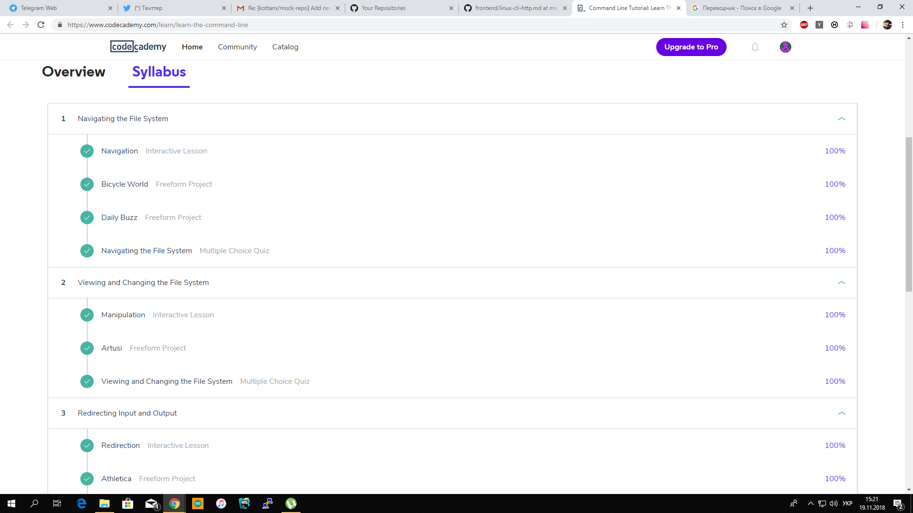
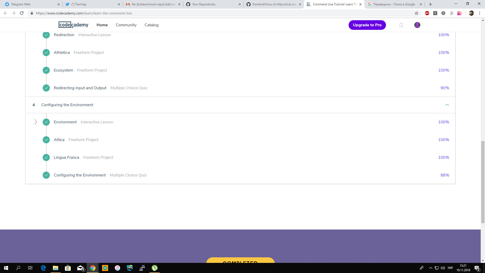
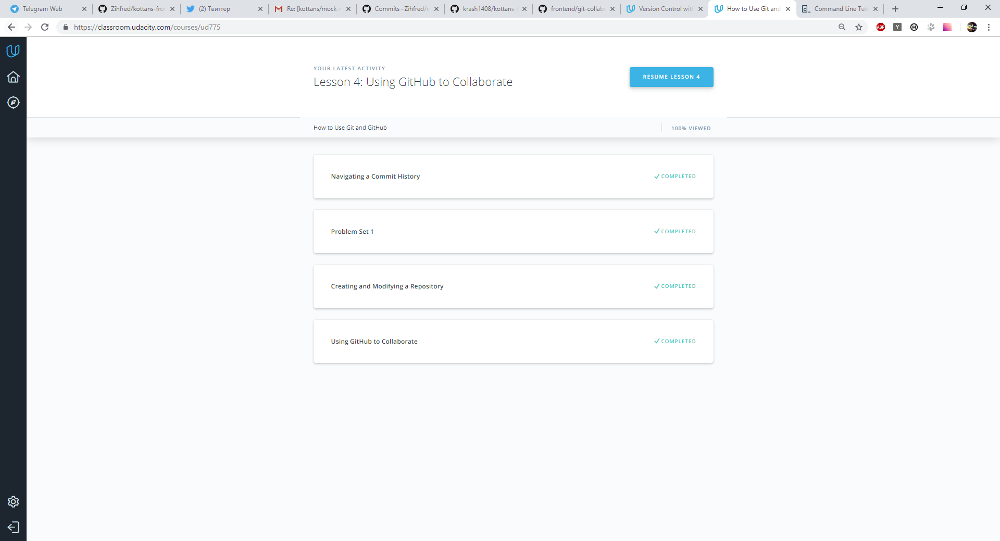
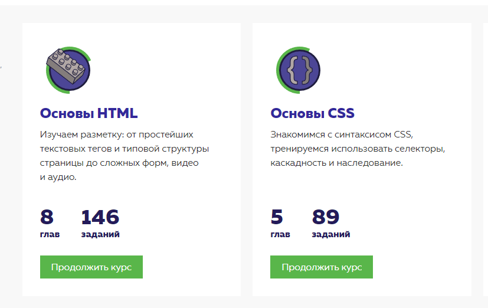
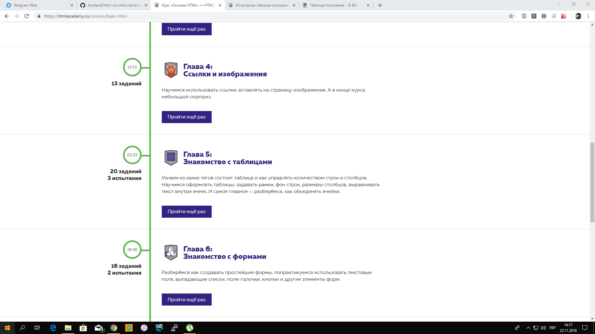
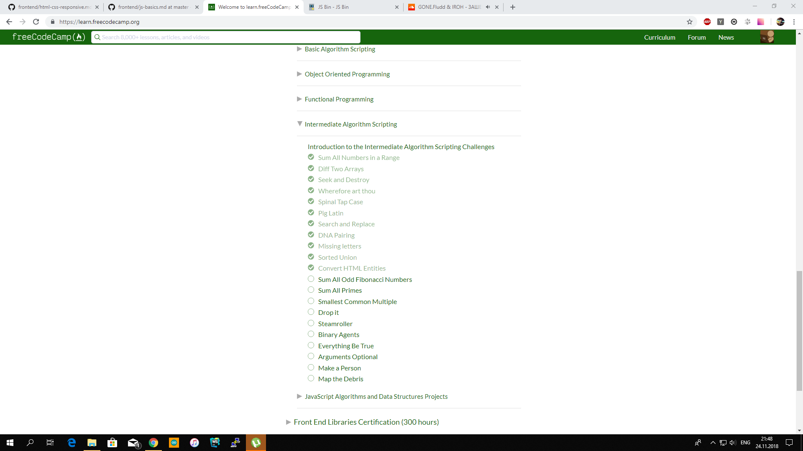
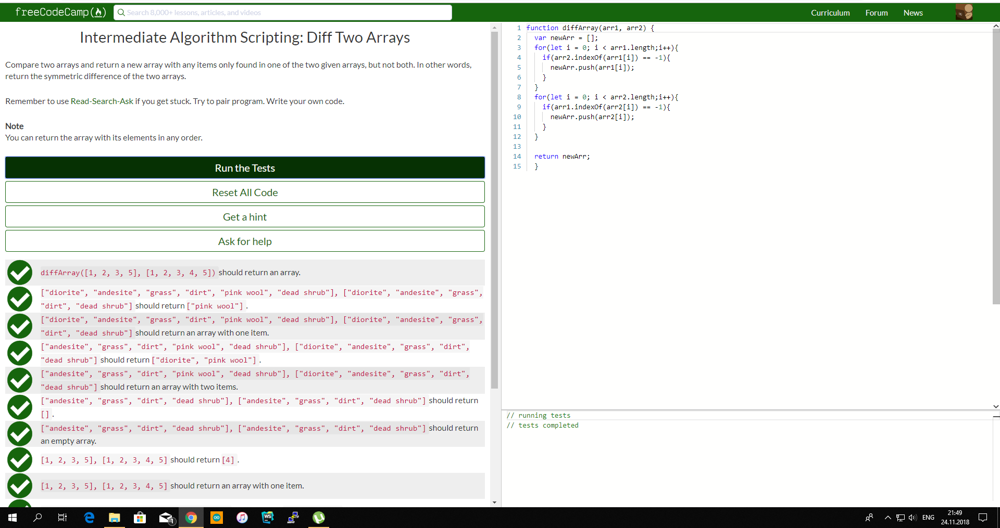

# kottans-frontend

This information was very helpful. Both for beginners and experienced users! GitHab is very convenient, it saves time, now you do not need to send archives and other nonsense

_____________________________________

## Linux CLI, and HTTP

What was new:
* Information about move files and directories
* Nano
* BASH 

_____________________________________

## Git Collaboration

_____________________________________

## Intro to HTML and CSS

It's good course to refresh your base knowledge

What was new:
* < del >, < ins >
* < label > 

______________________________________

## JS Basics

Very interesting part of tasks. Hope, that second part will be more interesting!

______________________________________

