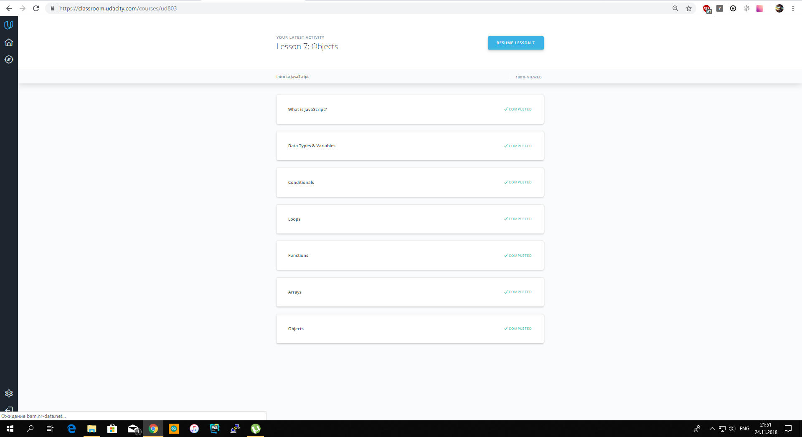
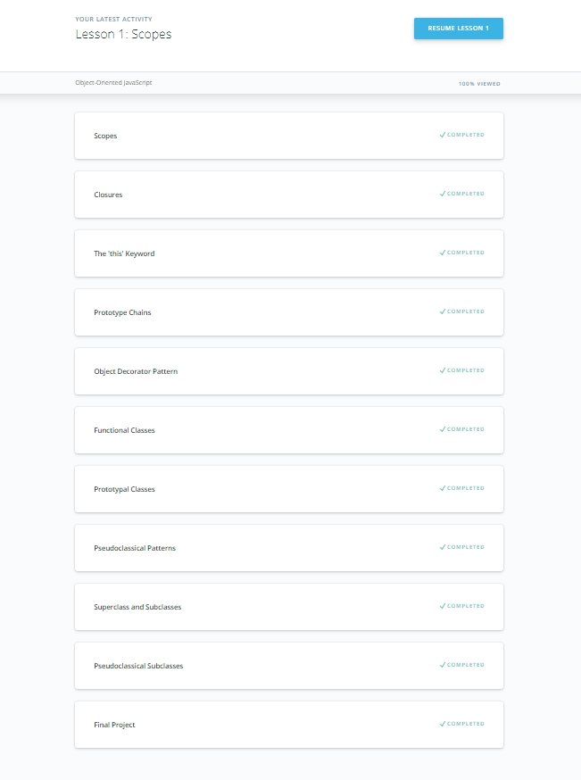
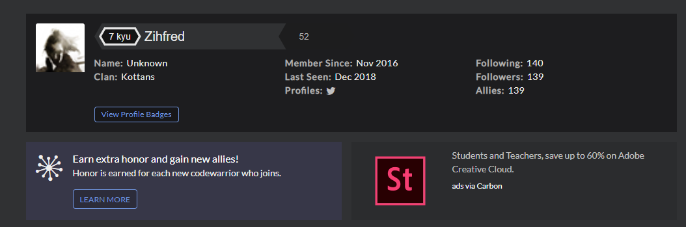

[%3D-mastered%20conflict%20resolution-brightgreen.svg)](https://github.com/kottans/kottans/blob/master/endorsements.md)

# kottans-frontend

This information was very helpful. Both for beginners and experienced users! GitHab is very convenient, it saves time, now you do not need to send archives and other nonsense

_____________________________________

## Linux CLI, and HTTP

What was new:
* Information about move files and directories
* Nano
* BASH 

_____________________________________

## Git Collaboration

_____________________________________

## Intro to HTML and CSS

It's good course to refresh your base knowledge

What was new:
* < del >, < ins >
* < label > 

______________________________________

## JS Basics

Very interesting part of tasks. Hope, that second part will be more interesting!

______________________________________

## Object Oriented JS

## A Tiny JS World

[Code](https://github.com/kottans/frontend-2019-homeworks/blob/master/submissions/zihfred/index.js)

Reviewed and approved by @OleksiyRudenko
