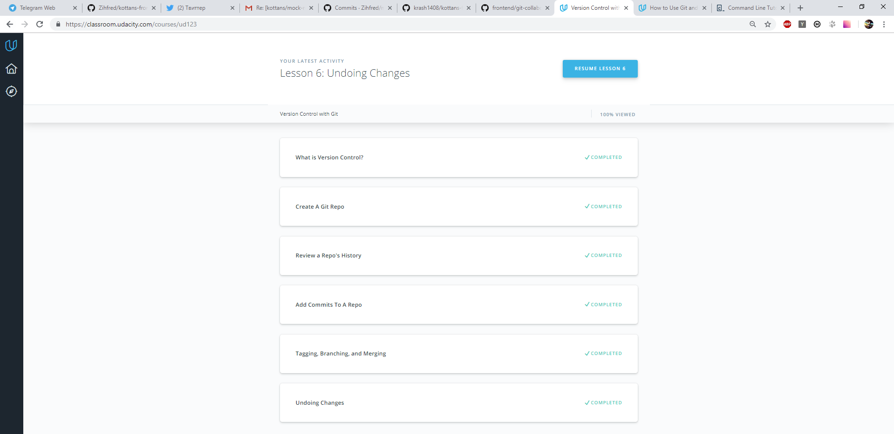

# kottans-frontend

This information was very helpful. Both for beginners and experienced users! GitHab is very convenient, it saves time, now you do not need to send archives and other nonsense

_____________________________________

## Linux CLI, and HTTP

What was new to you:
* Information about move files and directories
* Nano
* BASH 

_____________________________________

## Git Collaboration

